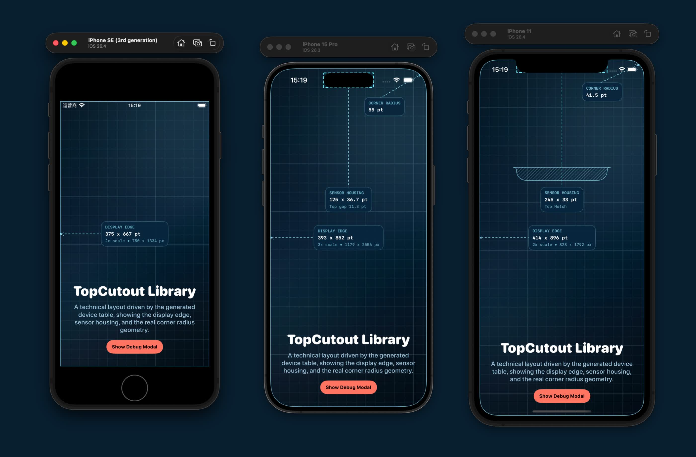

# TopCutout

`TopCutout` is a small iOS Swift package that exposes top cutout geometry for iPhone screens, including classic notches and Dynamic Island devices.

It is useful when you need more than safe-area insets alone. Instead of only knowing how far content should stay away from the top edge, you can retrieve the cutout kind, exact cutout size, top padding, and helper geometry for the free space on each side.

**NO Private API.**



## Features

- Runtime lookup for the current device using the model identifier
- Generated catalog of iPhone screen metadata and top cutout geometry
- Distinguishes between `.none`, `.notch`, and `.dynamicIsland`
- Helper APIs for the cutout rect, occupied top band, and left/right "ear" regions
- Optional SwiftUI `Path` data for supported sensor housing outlines
- Included demo app and catalog-generation scripts

## Requirements

- iOS 15+

## Installation

### Swift Package Manager

Add the package in Xcode with `File > Add Package Dependencies...` and use:

```text
https://github.com/rijieli/TopCutout.git
```

Then add the `TopCutout` product to your target:

```swift
.target(
    name: "YourApp",
    dependencies: [
        .product(name: "TopCutout", package: "TopCutout")
    ]
)
```

## Main Entry and API

`TopCutoutCatalog` is the main runtime entry point.

- `TopCutoutCatalog.current -> TopCutoutInfo?`
- `TopCutoutCatalog.screen -> ScreenInfo?`

Both values are `nil` when the current model identifier is not present in the generated catalog.

### `TopCutoutInfo`

Represents the resolved top cutout for the current screen.

- `kind`
- `geometryAvailable`
- `curveAvailable`
- `size`
- `paddingTop`
- `rect(in:)`
- `occupiedTopBand(in:)`
- `leadingEarRect(in:)`
- `trailingEarRect(in:)`
- `recommendedButtonCenters(in:buttonSize:sidePadding:)`

### `ScreenInfo`

Represents screen metadata plus top cutout data.

- `points`
- `pixels`
- `scale`
- `dpi`
- `cornerRadiusPoints`
- `topCutout`

### `TopCutoutCatalog.Device`

Generated device catalog with:

- `displayName`
- `screen`
- `sensorHousingPath`

The current generated catalog includes 42 iPhone identifiers.

## Development

Build the package for iOS Simulator:

```bash
xcodebuild -scheme TopCutout -destination 'generic/platform=iOS Simulator' build
```

Refresh the generated catalog from installed Simulator assets:

```bash
python3 inspect_simulator_topcutouts.py
```

Refresh Dynamic Island probe results with the demo app workflow:

```bash
python3 collect_dynamic_island_simulator_info.py
```

## Demo App

[`TopCutoutDemo`](./TopCutoutDemo) is a lightweight SwiftUI app used both as a visual demo and as part of the probing workflow for Dynamic Island geometry.

Use it to:

- Visualize the resolved cutout region
- Inspect debug output for the current simulator
- Validate spacing assumptions when updating generated data

## Contributing

Contributions are most useful when they improve one of these areas:

- Newly released device support
- Corrections to generated geometry
- Better demo coverage
- Tests and validation tooling
- Documentation and examples

When changing generated data, keep the generated Swift files and the source data in sync.
